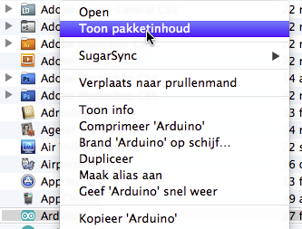
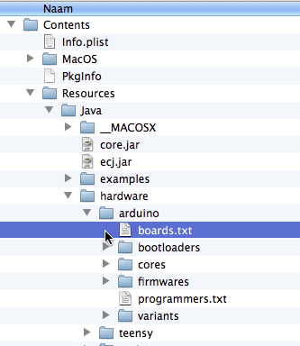
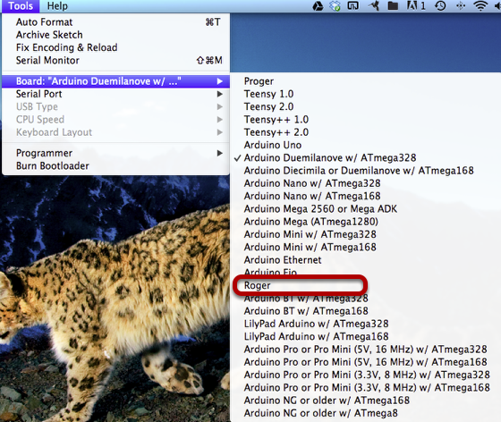

This tutorial describes how to add the Roger to the arduino ide	

* First download the Roger arduino addon [here](https://github\.com/bazingalabs/rogerfirmware/zipball/master)

* Now extract the zipfile somewhere and open the file boards\.txt

add the contents of boards\.txt to the contents of your arduino boards\.txt

restart your arduino ide
you should now see the Roger appear in the list of arduino boards

Select the Roger board and start coding\!

