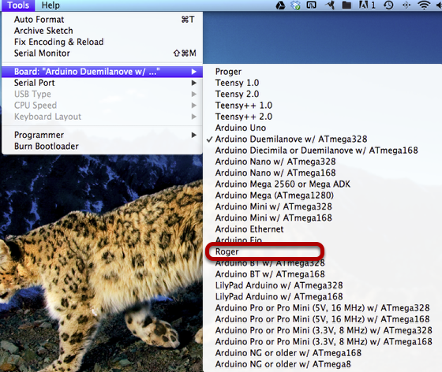

In this tutorial we will explain how to use the Roger as an Arduino with a radio using the RB12 arduino library.

* In order to program the Roger we need to insert a 100nF Cap between the pins DTR and reset as illustrated below

* If you have added the Roger addons you simply select the Roger board from the list of boards otherwise select the Arduino Pro mini 8mHz W/Atmega328

Time to install the RF12B library.

You can download the library using git or dawload a zipfile the zipfile can be found [here](https://github\.com/bazingalabs/RF12B/zipball/master)
If you want to use git you can use the following git url https://github.com/bazingalabs/RF12B.git

* Extract/clone the library to your Sketches/libraries folder (Arduino IDE 1.0 and up should find libraries in here automatically)

* Restart your Arduino IDE

* Try out some examples
